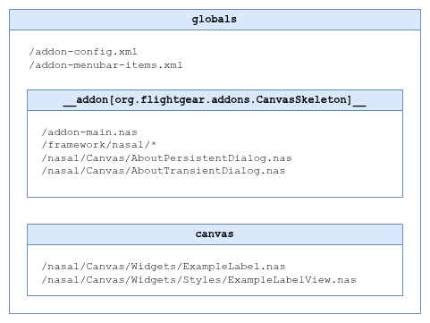
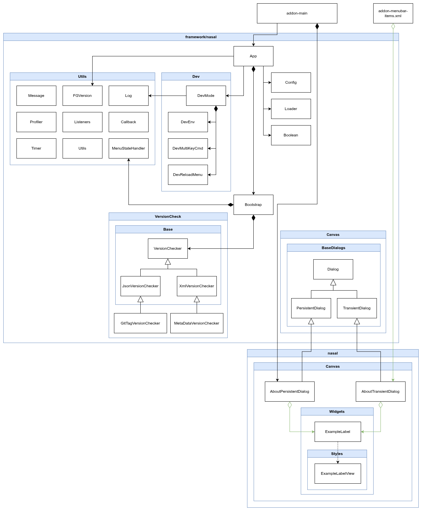

Canvas Skeleton Add-on for FlightGear
=====================================

First, read [README.add-ons](https://gitlab.com/flightgear/fgdata/-/blob/next/Docs/README.add-ons), which explains how add-ons work in FlightGear.

This is a Canvas Skeleton add-on. Use it as a simple starting point for your own FlightGear add-on. The difference from [Skeleton](https://sourceforge.net/p/flightgear/fgaddon/HEAD/tree/trunk/Addons/Skeleton/) is that this add-on is based on a GUI built with Canvas. So if you need a Canvas-based GUI, this is the place to start.

This skeleton favors object-oriented programming (one class per file, with each class having a single responsibility), but you can also write procedural code and put 5K lines in one file – if that's what you're comfortable with :) Methods and class members intended to be private or protected start with an underscore `_`. Nasal doesn't enforce this like C++, but it helps clarify the code's intent.

This add-on includes many files you might find unnecessary. For example, the entire `/nasal/Utils` directory contains helper classes you don't have to use. These are mostly wrappers for FlightGear functions that make them easier to work with, but you can safely do without them.

## Features in brief

1. Automatic recognition and loading of add-on Nasal files into the appropriate namespaces (with an exclusion list if necessary).
2. Ability to add a menu for restarting add-on Nasal files without having to change repository files.
3. Ability to define keys for the multi-key command to restart add-on Nasal files without having to change repository files.
4. A mechanism for checking whether there is a new version of your add-on to inform users about it.
5. Base classes for Canvas windows that are created and destroyed on demand (Transient dialog), as well as created once during simulator startup (Persistent dialog). And examples of how to use them.

## Reload add-on and `.env` file

One significant feature is not using a hard-coded menu item to reload the add-on's Nasal files. After spending many hours developing add-ons for FlightGear, I realized I needed a solution that wouldn't interfere with the repository and wouldn't require me to constantly remember not to commit the `/addon-menubar-items.xml` file with an uncommented reload menu item.

To solve this, I implemented a mechanism inspired by other frameworks – an `.env` file for local configuration that isn't added to the repository (the `.env` file is listed in `.gitignore`). If you create an `.env` file (copy `.env.example` as a starting point), you can set the variable `DEV_MODE=true` and `RELOAD_MENU=true`. This will automatically and programmatically add a **Dev Reload** menu item, allowing you to reload the add-on's Nasal files without restarting the simulator.

You can also use the multi-key command (default `:Yacs`) to restart the Nasal files of the add-on, which is defined in the `.env` file as `RELOAD_MULTIKEY_CMD="Yacs"`. Of course, you should change the keys to your own. I adopted the notation `Y`, as in FlightGear this key means "Development", then I adopted `a` from "addons", and then at least one key from the name of the add-on. By default, we have `cs` from the name "Canvas Skeleton", but you should change it to the name of your add-on.

Please note that when entering a multi-key command, suggestions do not work.

If you're not interested in this at all and don't want the add-on to load the Nasal classes associated with the `.env` file, you can disable this mechanism entirely. In the `/Config.nas` file, set the `Config.dev.useEnvFile` field to `false`.

## Canvas Dialog

This add-on contains two examples of creating a Canvas window:

1. **Transient** – ​​the window is created only when the user executes an open action, in this add-on by select the "Transient About Dialog..." menu item. When the window is closed, the window is destroyed (removed from memory).
2. **Persistent** – ​​the window is created once, when the simulator starts, and is immediately hidden. When the user executes an open action (e.g., the "Persistent About Dialog..." menu item), the window is simply shown (the `show()` method). When the user closes the window, the `hide()` method is called.

|            | Advantages | Disadvantages |
|------------|------------|---------------|
| Transient  | Simple implementation. It's easier to destroy everything and recreate it. <br><br> It only uses memory when the user wants to display the window. | There's a noticeable 1-2 second delay in the window's content appearing because the window must first be created in memory. <br><br> The window won't remember its last position and size because it's always recreated. |
| Persistent | The window's content is quickly displayed to the user because the window itself has already been created and is now just coming out of hiding. <br><br> If the user resizes or moves the window, when it is reopened, the window will be as it was left. | The window takes up memory, even if the user never opens it. <br><br> It complicates the code somewhat because it's easier to delete everything and recreate it. |

Although the default behavior in FlightGear is to create and delete a window each time, I personally prefer windows created once – the memory is there to speed up the program, so I use it in my add-ons.

> I ran a test for the Logbook add-on, which has 9 Persistent Canvas windows, some of them quite complex, and opened them all. RAM usage was ~150 MiB higher compared to the same add-on modified so that it did not create any Canvas windows. This averages out to ~17 MiB per window. As you can see, this is not a huge amount of memory usage.

This add-on contains two examples of creating the same window, which is simply the "About" window:

1. The `AboutTransientDialog` class shows how to create windows that are created and destroyed repeatedly. This class inherits from `TransientDialog`, and as you can see, not much happens there, other than adding support for the Esc key, as this type of window requires no additional handling.
2. The `AboutPersistentDialog` class shows how to create a window once, when the add-on loads with the simulator. This class inherits from `PersistentDialog`, and as you can see, there's more code needed to properly handle such a window.

### `PersistentDialog` Class

When creating a dialog that inherits from `PersistentDialog`, the following happens in the `PersistentDialog.new()` method:

1. The window is hidden immediately after its creation, because we don't want it to automatically display without user action.
2. The `del()` method of the `Window` object is overridden by our function. FlightGear itself can call the `Window.del()` method when the user clicks the X on the window bar. However, in the case of a Persistent window, we don't destroy the window, we hide it. You could pass the `destroy_on_close` flag with the value `false` when creating the window, and FlightGear itself would call the `hide()` method instead of `del()`. However, FlightGear won't gain anything extra, and you might need to call `hide()` for additional actions in your dialog. For example, you have a dialog that needs to start its timer, but you need to stop the timer on the hide action, if only to prevent it from running in the background if it's not needed. In this case, your dialog must override the `hide()` method of the `PersistentDialog` class and stop the timer there; it's logical. However, Nasal doesn't support polymorphism. That is, if the base class calls its `hide()` method, your dialog's `hide()` will not be called! Therefore, the `PersistentDialog` class already includes implemented logic for calling its child methods. This is handled by the `_callMethodByChild()` method. However, for the `PersistentDialog` class to know who its child is, you must tell it by calling the `setChild()` method.

#### Center position

Additionally, the `PersistentDialog` class has additional logic for positioning the window in the center of the screen. By default, FlightGear opens Canvas windows in the center of the screen. However, a problem arises in Persistent dialog when the user changes the window size. For example, a user launched the simulator in an 800x600 window but later stretched it to the 1920x1080 resolution. This means that when the Persistent window was created, the resolution was 800x600, and the window calculated the center for that resolution. Therefore, when the user opens the Persistent window after changing the resolution to 1920x1080, the window will not be centered on the screen, but will instead be displayed in the upper-left corner. Therefore, the `PersistentDialog` class solves this problem by adding listeners (`_addScreenSizeListeners()`), which react to the FlightGear window's resolution change and recalculate the center of the screen.

In `TransientDialog` you don't need this logic because the Transient is always created anew, so it will always adjust to the current center of the screen.

## Minimal example of creating a Transient dialog

```nasal
var AboutDialog = {
    #
    # Constructor.
    #
    # @return hash
    #
    new: func {
        var obj = {
            parents: [
                AboutDialog,
                TransientDialog.new(        # Inheriting from the TransientDialog class
                    width: 300,
                    height: 400,
                    title: "About Canvas Skeleton",
                ),
            ],
        };

        # Crate your stuff here ...
        # Dialog already has a canvas.VBoxLayout prepared for adding more elements to the dialog:
        # obj._vbox.addItem(...);

        return obj;
    },

    #
    # Destructor.
    #
    # @return void
    # @override TransientDialog
    #
    del: func {
        # Destroy your stuff here if needed...

        call(TransientDialog.del, [], me);
    },
};
```

## Minimal example of creating a Persistent dialog

```nasal
var AboutDialog = {
    #
    # Constructor.
    #
    # @return hash
    #
    new: func {
        var obj = {
            parents: [
                AboutDialog,
                PersistentDialog.new(       # Inheriting from the PersistentDialog class
                    width: 300,
                    height: 400,
                    title: "About Canvas Skeleton",
                ),
            ],
        };

        # Let the parent know who their child is.
        call(PersistentDialog.setChild, [obj, AboutDialog], obj.parents[1]);

        # Enable correct handling of window positioning in the center of the screen.
        call(PersistentDialog.setPositionOnCenter, [], obj.parents[1]);

        # Crate your stuff here ...
        # Dialog already has a canvas.VBoxLayout prepared for adding more elements to the dialog:
        # obj._vbox.addItem(...);

        return obj;
    },

    #
    # Destructor.
    #
    # @return void
    # @override PersistentDialog
    #
    del: func {
        # Destroy your stuff here...

        call(PersistentDialog.del, [], me);
    },

    #
    # Show the dialog.
    #
    # @return void
    # @override PersistentDialog
    #
    show: func {
        # Add more stuff here on show the window if needed...

        call(PersistentDialog.show, [], me);
    },

    #
    # Hide the dialog.
    #
    # @return void
    # @override PersistentDialog
    #
    hide: func {
        # Add more stuff here on hide the window if needed, like stop timer, etc...

        call(PersistentDialog.hide, [], me);
    },
};
```

## Deferring Canvas loading

Creating Canvas windows immediately when the simulator starts (`PersistentDialog`) has another drawback I haven't mentioned yet. Many aircraft developers assume that Canvas indices and textures will never change, and simply hardcode expectations like "the PFD texture is always at index 10." This can cause unintended side effects, such as your dialog boxes appearing on aircraft displays!

To avoid this, the add-on defers the creation of its `PersistentDialog` windows by 3 seconds (see timer in `/Bootstrap.nas` file). This allows the aircraft's Canvas windows to be created first, and only then initializes the add-on's windows.

This approach also requires disabling any menu items that open Canvas windows until those windows have been created. Otherwise, clicking such a menu item could try to show a non-existent Canvas window and cause the add-on to crash.

If aircraft implementations improve, or if FlightGear introduces a proper solution, this delay will no longer be necessary.

Of course, for simpler cases, you can also solve this differently, for example, by always creating a Persistent dialog for a menu action (if it hasn't been created yet). Then all this delay-loading logic might be unnecessary. But then you'll need more logic in the menu.

## Structure of the add-on

The first and most important Nasal file loaded by FlightGear is `/addon-main.nas`. In this skeleton, its sole responsibility is to load the other Nasal files into their appropriate namespaces an bootstrap the add-on. By default, files are loaded into the default add-on namespace created by FlightGear for each addon: `__addon[your-addon-id]__`. However, files related to custom Canvas widgets are loaded into the `canvas` namespace.

If you add new `.nas` files to the project, you don't need to modify anything – `/Loader.nas` will automatically detect and load them when the add-on restarts. However, keep in mind:

- Other Nasal files can be placed in the add-on's root directory `/` or in the `/nasal` subdirectory.
- Any additional subdirectories for Nasal must be located inside `/nasal` directory.
- All Nasal files must use the `.nas` extension, otherwise they won't be recognized.
- Widget files must be placed in the `Widgets` directory inside somewhere `/nasal` directory; all files there are automatically loaded into the `canvas` namespace.

After loading all Nasal files, the `Bootstrap.init()` method is executed.

The `/nasal/Bootstrap.nas` file should prepare any required directories and initialize your classes. In this skeleton, only the `AboutPersistentDialog` class is created here. You can add more Persistent dialogs the same way. Note that the `AboutPersistentDialog` instance is created inside a timer that delays Canvas window creation by 3 seconds, for the reasons explained earlier.

Directory structure for Nasal files:

- `/` – you can place other Nasal files in the main project directory if you need to, but they cannot be widget files.
- `/nasal` – place your add-on logic Nasal files here (not related to Canvas).
- `/nasal/Utils` – supporting Nasal files such as wrappers, facades, etc. Something that can be universal for any add-on.
- `/nasal/Utils/Dev` – Nasal support files, for development purposes only.
- `/nasal/Utils/VersionCheck` – Nasal files related to the mechanism of detecting whether there is a newer version of the add-on.
- `/nasal/Canvas` – Nasal files related to drawing in Canvas. This is where you should create new dialog files in Canvas.
- `/nasal/Canvas/Widgets` – Nasal widget files for Canvas (models). You should create your new widgets here.
- `/nasal/Canvas/Widgets/Styles` – Nasal widget files for Canvas (views).

## Config.nas

The `/Config.nas` file contains a hash of the framework configuration, where you can change some options:

1. `excludedFiles` – a vector with a list of Nasal files that should not be loaded when the add-on starts. If you want to keep a Nasal file in the project but don't want to use it, you can add it to this list. The file must be preceded by a path relative to the add-on's root directory, and the path must begin with `/`, where `/` is the project's root directory. Note that some files have already been added here, such as the main `/addon-main.nas` file, which FlightGear loads itself, and auxiliary files that are included in `/addon-main.nas`, so there's no need to load them again via `Loader`.
2. `useVersionCheck` – here you can enable one of the methods for checking for a newer version of your add-on. You can also disable (`false`) all the options included here if you don't need this mechanism.
3. `dev`:
    * `useEnvFile` – here you can enable/disable the use of the `.env` file and thus load the classes needed to handle this file and the options it contains.

More detailed descriptions can be found in the `/Config.nas` file for each option.

## A little bit about widgets

A widget is divided into two files: one for the **model** and one for the **view**.

1. The **model** stores the data needed by the view and serves as the first layer of contact with the application. It exposes methods for passing data to and from the application.
2. The **view** handles the actual drawing, which is the widget's main purpose.

The view is hidden behind the model, so your application should not interact with the view directly. In this add-on, the model is implemented in the `ExampleLabel` class, and the view in the `ExampleLabelView` class.

## Namespaces

As you can see in the `/addon-main.nas` file, the namespace into which the add-on's additional Nasal files will be loaded is set as `var namespace = addons.getNamespaceName(addon);`. So it will be a namespace created by FlightGear, in the format `__addon[your-addon-id]__`, where `your-addon-id` is the ID of your add-on specified in the `/addon-metadata.xml` file. To access this namespace, you need to refer to it as follows: `globals[‘__addon[your-addon-id]__’]`, which you can see in the `/addon-menubar-items.xml` file. This is an inconvenient and long name to use, so if you want, you can create a global alias for it, e.g.:

```nasal
var namespace = addons.getNamespaceName(addon);

# Create an alias to the add-on namespace for easier reference in addon-menubar-items.xml:
globals.canvasSkeletonAddon = globals[namespace];
```

Here, of course, change the name `canvasSkeletonAddon` to something that reflects your addon and is unique to the entire FlightGear project. Now, in the `/addon-menubar-items.xml` file, you can refer to the addon variables like this: `canvasSkeletonAddon.g_AboutDialog.show();`, which greatly simplifies the code.

Another solution would be to load all additional Nasal files into your namespace, e.g., `canvasSkeletonAddon`, by replacing the line:

```nasal
var namespace = addons.getNamespaceName(addon);
```

with:

```nasal
var namespace = 'canvasSkeletonAddon';
```

However, in this case, to access variables or classes loaded from other files, such as `Bootstrap`, you must precede each call with your namespace, which can be another inconvenience, e.g.:

```nasal
canvasSkeletonAddon.Bootstrap.init(addon);
```

In this case, your addon will use two namespaces: `__addon[org.flightgear.addons.CanvasSkeleton]__` and `canvasSkeletonAddon`. The files `/addon-main.nas`,  `/Config.nas` and `/Loader.nas` will be loaded into the first namespace. The rest of the Nasal files (that are not Canvas widgets) will be loaded into the second namespace.

As you can see, there are many solutions you can use. By default, the framework loads Nasal files into `__addon[your-addon-id]__`, which means it does not create additional namespaces, keeping everything in one place.

However, Canvas widgets are (and must be) loaded into the `canvas` namespace. This is the namespace used by FlightGear. It's important that your widget names don't conflict with other names used in this namespace, including those loaded from other add-ons. Therefore, if you're migrating a widget from another add-on or FlightGear to your project, rename it in the code to a unique name (both the view and the model).



## You can also see add-ons written based on this skeleton

A great way to get familiar with writing add-ins in Canvas is to explore working add-ins based on this framework:

1. [Which Runway](https://github.com/PlayeRom/flightgear-addon-which-runway)
2. [Logbook](https://github.com/PlayeRom/flightgear-addon-logbook)
3. [Aerotow Everywhere](https://github.com/PlayeRom/flightgear-addon-aerotow-everywhere) – although it doesn't use Canvas (yet), it is also based on this framework.

## Class Diagram


