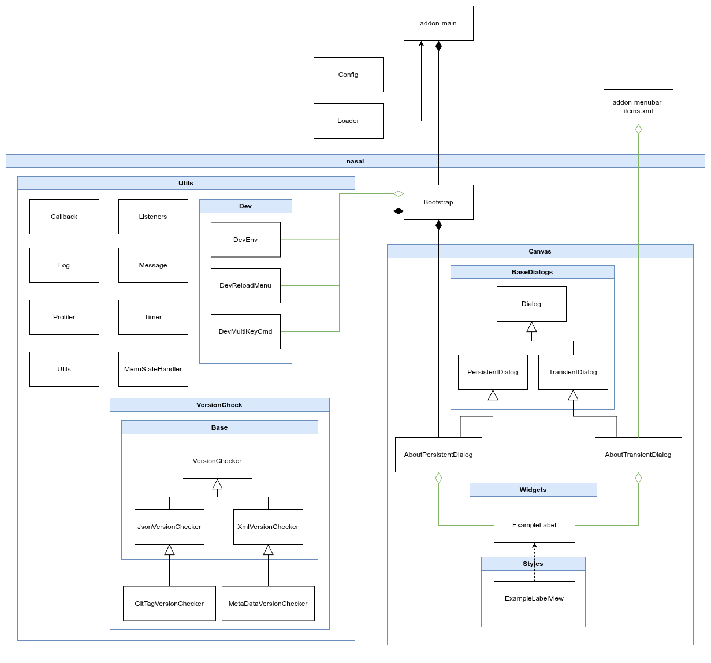

Canvas Skeleton Add-on for FlightGear
=====================================

This is a Canvas Skeleton add-on based on the [Framework](https://github.com/PlayeRom/flightgear-addon-framework) project, demonstrating how you can build your own add-on with Canvas windows using the Framework project. Use it as a simple starting point for your own FlightGear add-on. The difference from [Skeleton](https://sourceforge.net/p/flightgear/fgaddon/HEAD/tree/trunk/Addons/Skeleton/) is that this add-on is based on a GUI built with Canvas. So if you need a Canvas-based GUI, this is the place to start.

The Framework is a separate project located in the `/framework` directory and has a dedicated [GitHub repository](https://github.com/PlayeRom/flightgear-addon-framework). It facilitates the creation of add-ons and windows based on Canvas. You should not modify these files in `/framework` directory to avoid issues with updating the [Framework](https://github.com/PlayeRom/flightgear-addon-framework). To learn more about the capabilities of the Framework and therefore Canvas Skeleton, see the [Framework README](framework/README.md) file.

If you are not at all familiar with creating add-ons for FlightGer, please read [README.add-ons](https://gitlab.com/flightgear/fgdata/-/blob/next/Docs/README.add-ons) first, which explains how add-ons work in FlightGear.

## A little bit about widgets

A widget is divided into two files: one for the **model** and one for the **view**.

1. The **model** stores the data needed by the view and serves as the first layer of contact with the application. It exposes methods for passing data to and from the application.
2. The **view** handles the actual drawing, which is the widget's main purpose.

The view is hidden behind the model, so your application should not interact with the view directly. In this add-on, the model is implemented in the `ExampleLabel` class, and the view in the `ExampleLabelView` class.

**Note**: The Canvas and Widget APIs will likely change as Canvas itself is still under development, so you need to keep in mind that you will need to upgrade your widgets in the future.

## Unit Tests

To create unit tests, create a file with the `nut` extension in the `/tests` directory. Write a test in it. Each tests must be located in a global function, and the function name must begin with `test_`. Optionally, you can also add the `setUp` and `tearDown` functions, which will be run for each test.

### Run Unit Tests

Now, to run all tests in the `/tests` directory, copy the `/.env.example` file and rename it to `.env`. The `TEST_MULTIKEY_CMD` variable is located there. Assign it your own multi-key sequence. Also, set the `DEV_MODE` variable to `true`. Now, launch FlightGear (with the console) and enter the multi-key sequence. To enter the multi-key command in FlightGear:

1. Make sure the main simulator window is in focus.
2. Type a colon (`Shift+;`). A small dialog box should appear. Continue entering the keys according to the sequence provided in `TEST_MULTIKEY_CMD`.

Once the entire sequence is entered correctly, the tests will run automatically, and the result will be displayed in the standard output, i.e., the console and in the log file: `$FG_HOME/fgfs.log`.

## Namespaces

The image below shows which namespaces individual files and entire directories are loaded into.

## Class Diagram

## You can also see add-ons written based on this skeleton

A great way to get familiar with writing add-ins in Canvas is to explore working add-ins based on this framework:

1. [Which Runway](https://github.com/PlayeRom/flightgear-addon-which-runway)
2. [Logbook](https://github.com/PlayeRom/flightgear-addon-logbook)
3. [Aerotow Everywhere](https://github.com/PlayeRom/flightgear-addon-aerotow-everywhere) – although it doesn't use Canvas (yet), it is also based on this framework.
4. [Add-on Menu Aggregator](https://github.com/PlayeRom/flightgear-addon-menu-aggregator)
5. [Nasal Namespace Browser](https://github.com/PlayeRom/flightgear-addon-nasal-namespace-browser)
